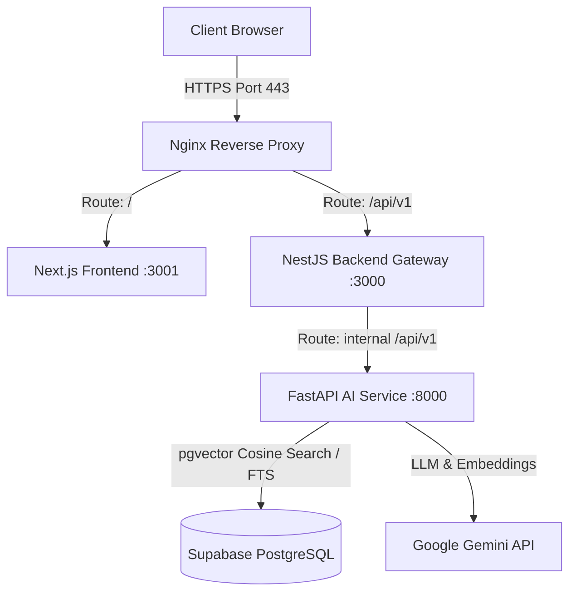
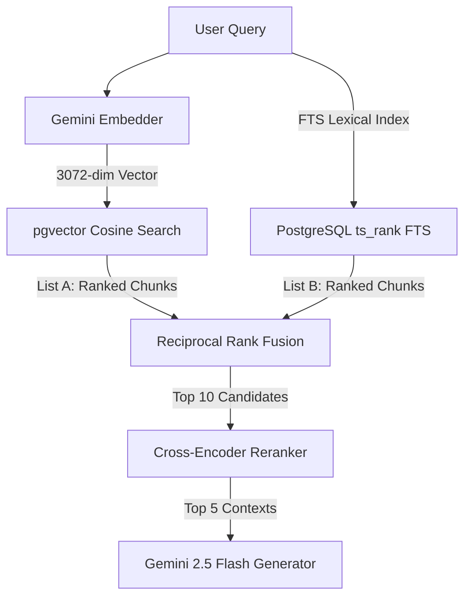

# MemoraAI

AI systems forget everything.

MemoraAI is a memory layer that helps AI assistants build long-term understanding of users by extracting, storing, retrieving, and injecting relevant context into future interactions.

The goal is not to store more information.
The goal is to surface the right information at the right time.

---

## ⚠️ The Problem

Stateless Large Language Models (LLMs) treat every interaction as if it is the first time they are meeting the user. Existing solutions try to solve this by:
1. **Shoving everything into the context window**: This leads to exponential token costs, latency spikes, and the "lost in the middle" retrieval degradation where LLMs fail to recall facts placed in large contexts.
2. **Naive RAG (Retrieval-Augmented Generation)**: Standard semantic retrieval frequently fetches irrelevant noise or fails to resolve exact keywords, acronyms, or references.
3. **Flat chat logs**: Treating memory merely as a raw database of past messages without structural representation, classification, or long-term user preferences extraction.

---

## 🏛️ System Architecture

MemoraAI runs as a containerized multi-tier service suite, engineered for reliability, low-latency execution, and granular observability.



### 🛰️ Request Context Flow & Distributed Tracing
1. **Trace Propagation:** Client requests are intercepted by Nginx and forwarded to the **Next.js Frontend**. A unique `x-request-id` transaction trace is generated (or captured) and sent to the **NestJS Backend Gateway**.
2. **NestJS Context Tracking:** The NestJS Gateway handles global rate-limiting (via `@nestjs/throttler` mapping `30 req/min` per IP), request schema validation, and maps the trace ID into Express Request context. Using `AsyncLocalStorage`, NestJS propagates the trace token downstream to all microservices.
3. **FastAPI Observability Middleware:** The core **FastAPI AI Service** extracts the `x-request-id` header in its `ObservabilityMiddleware`, binding it to python `structlog` contexts. Every database query, exception, or external LLM request is logged alongside this trace ID.
4. **Data Layer Ingress:** Queries are whitelisted inside FastAPI's DB connector (`db/connection.py`) against known database tables (`chunks`, `documents`) to block SQL injection vectors on dynamic queries, before executing against **Supabase PostgreSQL**.

---

## 🔍 Multi-Stage Hybrid Search & Reranking Pipeline

To maximize both **recall** (finding all candidate matches) and **precision** (ensuring the most relevant chunks are at the top), MemoraAI utilizes a multi-stage retrieval pipeline:



1. **pgvector Semantic Search:** Embeds query into a 3072-dimensional vector using `gemini-embedding-001`. Runs cosine distance (`<=>` operator) query against the database, filtering chunks above the configured `SIMILARITY_THRESHOLD`.
2. **Lexical Full-Text Search (FTS):** Formats the query into English lexical tokens and executes a GIN-indexed keyword search using `ts_rank` (equivalent to BM25 relevance ranking) to match exact terminology, acronyms, or numbers.
3. **Reciprocal Rank Fusion (RRF):** Blends the ranks of the vector and lexical search runs using the formula:
   $$\text{RRF Score} = \sum_{m \in \{\text{Vector}, \text{FTS}\}} \frac{1}{60 + \text{Rank}_m}$$
4. **Cross-Encoder Reranking:** Takes the top 10 RRF candidates and processes them together with the query through the `ms-marco-MiniLM-L-6-v2` transformer. The model uses self-attention to calculate deep token-level similarity, re-sorting candidates so the top 3-5 highly dense contexts are sent to the LLM.
   * *Docker Optimization:* The 150MB Reranker weights are cached directly inside the Docker image during the build stage, reducing cold-start container initialization in cloud platforms from 20s to 1.5s.

---

## 🧠 Memory Lifecycle

MemoraAI models human memory using a three-tier system: Short-Term, Long-Term, and Episodic.

```
┌────────────────────────────────────────────────────────┐
│                    MEMORY LIFECYCLE                    │
├────────────────────────────────────────────────────────┤
│                                                        │
│  [Ingestion / Input]                                  │
│         │                                              │
│         ▼                                              │
│  [Short-Term Memory] ──► (Active Session Context)      │
│         │                                              │
│         ├─► (Every 5 messages: Extract facts)          │
│         ▼                                              │
│  [Long-Term Memory] ──► (Persistent User Facts)        │
│         │                                              │
│         ├─► (On New Session/Clear: Summarize)          │
│         ▼                                              │
│  [Episodic Memory]  ──► (Chronological Session Events) │
└────────────────────────────────────────────────────────┘
```

1. **Ingestion (Active Interaction):** 
   - Files (PDFs), URL contents, or plain texts are parsed, chunked via a token-based sliding window (700 tokens, 100 overlap), vectorized, and saved globally in the `documents` and `chunks` tables.
   - User chat inputs are immediately committed to the `short_term_memory` table.
2. **Short-Term Context Retention:**
   - On every message query, the last 5 conversation pairs for the specific `session_id` are injected into the prompt context to maintain immediate dialog flow.
3. **Long-Term Fact Extraction (LTM):**
   - For every 5 messages exchanged, a background extraction event executes. The recent chat logs are evaluated by Gemini using structured JSON output schemas to distill personal user facts (e.g., *"user works as a backend developer"*, *"user prefers Python"*) into the `long_term_memory` table.
   - Relevant facts are retrieved and prepended to the system prompt dynamically on all future interactions.
4. **Episodic Summarization:**
   - When a session is closed (via clicking "New Session" or "Clear Chat" in the UI), the system calls `POST /api/v1/memory/episodic/summarize`.
   - The full chat log is summarized, and key topics and sentiment metrics are extracted and saved to `episodic_memory` before clearing short-term tables.

---

## ⚖️ Tradeoffs

Engineering a production memory system requires balancing performance, cost, and complexity:

* **Periodic vs. Inline Extraction:** 
  We run Long-Term Memory (LTM) fact extraction *asynchronously in the background every 5 messages* rather than inline during every user query. Inline extraction increases user latency by ~1.5s and bloats token expenses, whereas periodic asynchronous extraction keeps user interactions sub-second while maintaining semantic updates.
* **Bi-Encoder Embeddings vs. Cross-Encoder Rerankers:**
  Bi-encoder embeddings represent documents as static vectors for fast vector indexing, but cannot model complex query-context interactions. Cross-Encoders calculate deep cross-attention at runtime for superior accuracy but are compute-heavy. We run Vector+FTS first to retrieve 10 candidates, then run the Cross-Encoder *only on those 10 candidates* to maintain sub-100ms pipeline latencies while achieving high precision.
* **Global Supabase SQL Database vs. Session-Isolated Storage:**
  Ingested documents are stored globally in PostgreSQL rather than inside session scopes. This allows cross-session discovery (any session can query any past document) but requires extra care to prevent cross-user data leakage by enforcing user-id filters at the database query level.

---

## 💡 Lessons Learned

* **LLM JSON Extraction Fragility:** LLMs occasionally output unescaped quotes or nested markdown lists that crash standard parsers. In the offline evaluation engine (`evaluator.py`), we built an index-slicing backup parser (`_parse_judge_json`) that isolates brackets and keys to robustly extract scores and reasoning even if the JSON is malformed.
* **Vector Dimension Scaling Bottleneck:** Upgrading the embedding model to a 3072-dimensional output caused Supabase pgvector indexing scripts to crash because pgvector `ivfflat`/`hnsw` indexes restrict vector dimensions to a maximum of 2000. We learned to disable the vector indexes to allow 3072-dimension vectors while using exact nearest-neighbor search, which remains sub-millisecond for our database size.
* **Port Collision and Proxy Loops:** Running NestJS and Next.js both on port 3000 on Windows caused an infinite proxy loop because Next.js bound to IPv6 (`::1`) while NestJS bound to IPv4 (`0.0.0.0`). Standardizing the frontend on port 3001 and configuring explicit health and proxy re-writes in `next.config.js` fixed this loop.

---

## 🔮 Future Improvements

1. **Entity-Relation Graph Memory:** Move LTM from flat key-value facts to a Neo4j Graph database representation. This would allow the agent to understand multi-degree relationships between concepts (e.g. knowing that "React" is related to "Next.js").
2. **Relevance Decay & Memory Pruning:** Implement a chronological decay index ($e^{-\lambda t}$) on user facts. Facts that haven't been referenced in months or are contradicted by newer inputs would automatically prune or archive themselves.
3. **Adaptive Chunking:** Replace fixed sliding-window chunking with semantic chunking that detects changes in topics, headings, or paragraph structures, preserving context bounds more cleanly.

---

## ⚙️ Service Ports & Verification Commands

Verify system health and metrics endpoints post-deployment:

### Health Verification
```bash
# Core AI Service
curl http://localhost:8000/api/v1/health

# Backend Gateway
curl http://localhost:3000/api/v1/health
```

### Prometheus Metrics Scrape
```bash
# Scrape FastAPI core metrics
curl http://localhost:8000/metrics

# Scrape NestJS orchestrator metrics
curl http://localhost:3000/api/v1/health/metrics
```

### Run RAG Pipeline Quality Evaluation
```bash
docker compose exec ai-service python run_eval.py
```
This command runs the automated quality suite (LLM-as-a-judge scorers for Faithfulness, Relevance, and Recall) and writes the results to `docs/RAG_EVALUATION_REPORT.md`.

---

## ⚙️ Tech Stack

| Layer | Technology | Description |
|---|---|---|
| **Frontend** | Next.js 15, TypeScript, Tailwind CSS, shadcn/ui, Zustand, Framer Motion |
| **Backend Gateway** | NestJS, TypeScript, Express, Zod, Throttler Guard, class-validator | Gateway orchestration with distributed request tracing context and rate-limiting |
| **AI Microservice** | Python 3.11, FastAPI, asyncpg, Pydantic, Structlog, SentenceTransformers | Core service for hybrid retrieval, reranking, and cognitive memory lifecycle |
| **Database** | Supabase PostgreSQL + pgvector | Relational vector database supporting exact match indexes and FTS lexical ranks |
| **AI Foundations** | Google Gemini 2.5 Flash, `gemini-embedding-001`, `ms-marco-MiniLM-L-6-v2` | Advanced LLM generator, 3072-dimension embeddings, and cross-encoder rerank model |

---

